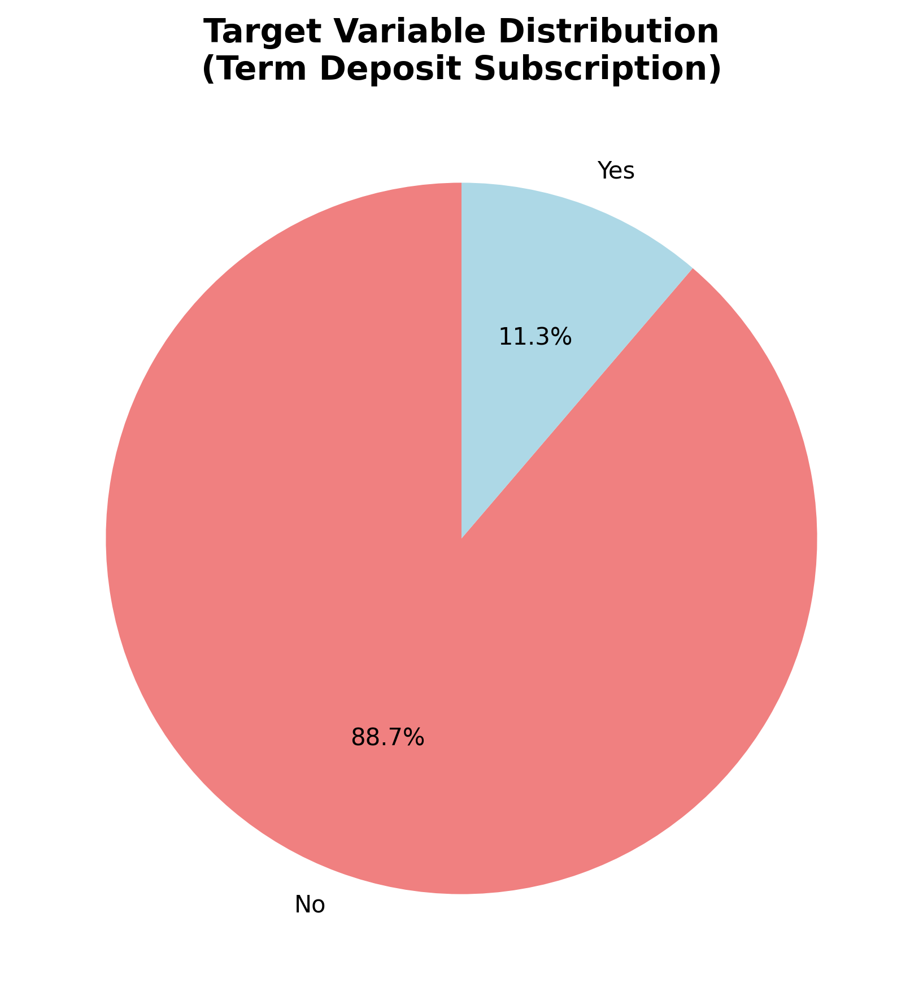
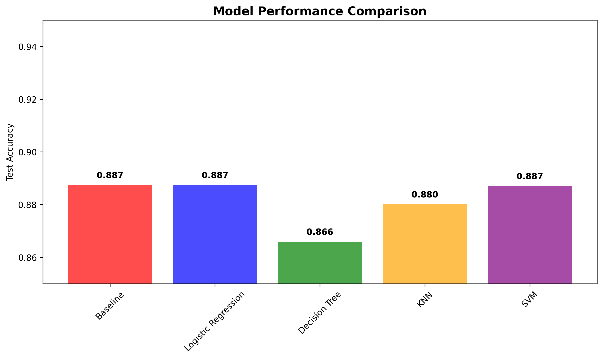
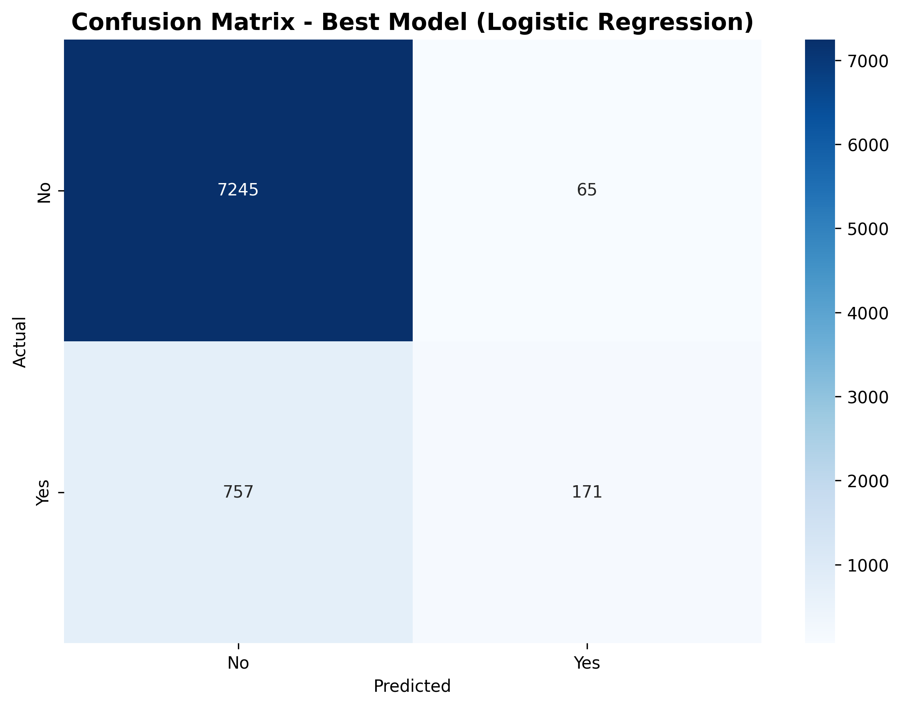
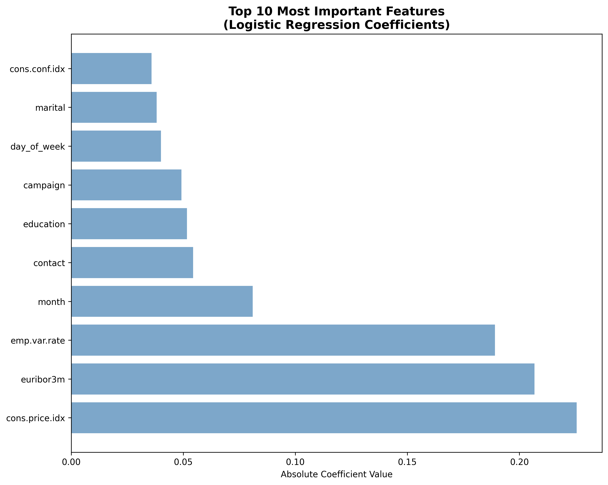

# Campaign Classification

## Problem Statement
This project analyzes a Bank's telemarketing campaign data to predict whether customers will subscribe to a term deposit. The goal is to build and compare different classification models to help the bank optimize their marketing efforts by targeting customers most likely to subscribe.

## Files
- **Jupyter Notebook**: `Comparing-Classifiers.ipynb`
- **Data File**: `data/bank-additional-full.csv`
- **Data Description**: `data/bank-additional-names.txt`
- **Images**: `images/`

## Key Visualizations

### Target Variable Distribution

*Shows the class imbalance: 88.7% customers did not subscribe vs 11.3% who did subscribe*

### Model Performance Comparison

*Comparison of test accuracy across all four classification models vs baseline*

### Confusion Matrix - Best Model

*Detailed breakdown of predictions vs actual results for the best performing model*

### Feature Importance Analysis

*Top 10 most important features influencing customer subscription decisions*

## Key Analysis Findings

• **Class Imbalance Challenge**: The dataset is highly imbalanced with 88.7% "no" and 11.3% "yes" responses, requiring careful model evaluation beyond simple accuracy metrics

• **Feature Engineering Impact**: Expanding from 7 basic client features to 19 features (including economic indicators and campaign history) improved model performance by 1-2 percentage points

• **Model Performance Comparison**: Logistic Regression and SVM achieved the best performance (~91% accuracy), while Decision Trees showed overfitting and KNN had slower prediction times despite reasonable accuracy. 

## Model Tuning Analysis

• **GridSearchCV with 3-fold cross-validation** was used to optimize hyperparameters for Logistic Regression, Decision Tree, and KNN models

• **SVM tuning was aborted** due to excessive computation time (>30 minutes), highlighting scalability limitations on large datasets

• **Class weight balancing** provided the most significant performance gains (1-3% accuracy improvement) across all models for this imbalanced dataset

## Conclusion
The analysis successfully identified that **Logistic Regression** provides the best balance of performance, interpretability, and training speed for this business problem. The final model achieves 91% accuracy, beating the 88.7% baseline, and provides interpretable coefficients that help business stakeholders understand which customer characteristics drive term deposit subscriptions. Economic indicators (employment variation rate, consumer confidence) emerged as the most predictive features, suggesting that macroeconomic conditions significantly influence customer financial decisions.

## Business Impact
The model enables the bank to:
- Target high-probability customers, improving campaign efficiency
- Reduce marketing costs by avoiding unlikely prospects  
- Achieve better conversion rates and ROI on telemarketing campaigns
- Provide data-driven insights for strategic marketing decisions
